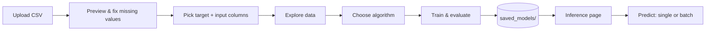

# 🤖 Auto-ML

**Upload a CSV, get a trained model.** A Streamlit app that automates the boring parts of the ML workflow — EDA, preprocessing, model training and evaluation — for both classification and regression, with zero code required.

<p>
  
  
</p>

## Contents

- [🤖 Auto-ML](#-auto-ml)
  - [Contents](#contents)
  - [Features](#features)
  - [Quick start](#quick-start)
  - [How it works](#how-it-works)
  - [Supported models](#supported-models)
  - [Project layout](#project-layout)
  - [Sample datasets](#sample-datasets)

## Features

<details open>
<summary><strong>Train</strong> — upload → explore → train → evaluate</summary>

- Upload any CSV, or start instantly with a bundled sample dataset
- Missing-value detection with one-click fix strategies (drop / mean / median / zero-fill)
- Auto-detects the target column and whether the problem is classification or regression
- Interactive EDA across 8 tabs: correlation heatmap, distributions, box plots, scatter plots, categorical breakdowns, plus Seaborn-powered pair plots, joint plots, and a hierarchically clustered correlation map
- One dropdown to pick an algorithm — classical ML or an LSTM deep learning model
- Auto-generated metrics: accuracy/precision/recall/F1/ROC-AUC for classification, RMSE/MAE/R² for regression
- Confusion matrix, ROC curves, feature importance/coefficients, residual plots — all interactive Plotly charts
- Every trained model is saved to disk with its scaler, encoders, and metadata

</details>

<details>
<summary><strong>Inference</strong> — load a saved model and predict</summary>

- Pick any previously trained model from a dropdown
- Predict on a single record via a form, or batch-predict on an uploaded CSV
- Class probabilities shown as a table + bar chart for classification
- Download batch predictions as CSV

</details>

## Quick start

```bash
git clone https://github.com/trainOwn/Auto-ML
cd Auto-ML
pip install -r requirements.txt
streamlit run app.py
```

Open the local URL Streamlit prints (usually `http://localhost:8501`), then either upload your own CSV or click **Use Sample Dataset** on the Train page.

## How it works



## Supported models

| Classification | Regression |
|---|---|
| Logistic Regression | Linear / Ridge / Lasso / ElasticNet |
| Decision Tree | Decision Tree |
| Random Forest | Random Forest |
| Gradient Boosting | Gradient Boosting |
| AdaBoost | AdaBoost |
| SVC | SVR |
| K-Nearest Neighbors | K-Nearest Neighbors |
| Naive Bayes | — |
| XGBoost | XGBoost |
| LSTM | LSTM |

The app auto-detects binary vs. multiclass classification and balances the test set across classes for fair metrics.

## Project layout

```
app.py                  # entry point — sets up navigation between pages
pages/
  train.py              # upload, EDA, training, evaluation, model saving
  inference.py          # load a saved model, predict single/batch
  styles.py             # shared CSS theme + UI helpers
dataset/                # sample CSVs to try the app with
saved_models/           # trained models + scaler/encoders + metadata.json
```

## Sample datasets

Three ready-to-use CSVs live in `dataset/` so you can try the app immediately:

- `air-compressor.csv`
- `hydraulic_system_features.csv`
- `CNC_tool_wear_final.csv`
